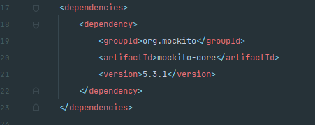
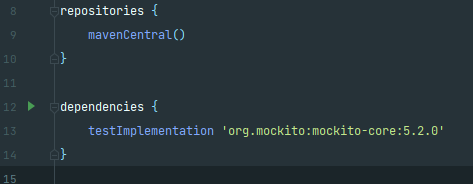

# Mockoup de Classes: Mockito

**Integrantes: Gabriella Souza Aguiar e Wallace Freitas Oliveira**

# Introdução

O processo de testes é uma etapa fundamental no desevolvimento de softwares, pois durante a execução dessa se torna possivel verificar e corrigir se necessário diversos aspectos da solução impelementada, garantindo assim a melhor qualidade possivel do projeto. Os teste de softwares se dividem em diferentes tipos: testes unitarios, de integração e de sistema, cada um desses apresentam suas especificidades própias e motivações para seu uso. Nesse pequeno tutorial abordaremos o processo de teste unitário ultilizando da estratégia de mockoup de classes, para realizar a verificação de classes em java, com o auxilio do Framework Mockito.

Iniciamos definindo a motivação para realizar testes de classes, imagine-se na seguinte situação: Você deve implementar uma nova classe X que depende da integração com uma classe Y. No entanto, para assegurar o ideal funcionamento de X, é necessário que essa classe seja testada, mas como realizar esse teste, uma vez que X depende do funcionamento de Y, e é nesse momento que surge a necessidade de realizar o mockoup de classes. O mockoup de classes, consiste na criação de objetos simulados dentro de um sistemas de testes para que outras classes dependentes da classe mockada consigam ser testadas. Esses objetos criados, imitam o comportamento real da classe base (classe da qual foi instânciada) permitindo assim, que as demais as ultilizem para realizar os testes necessários de maneira isolada e verificar o funcionamento da solução.

# Mockito Framework

O framework Mockito, é uma das soluções de código aberto mais conhecidas e amplamente ultilizadas para realização de testes unitários em java quando o foco é na implementação de mocks de classes e interfaces. Atualmente é mantido e atualizado pela comunidade de desenvolvedores através do gitHub (https://github.com/mockito/mockito) e se encontra na versão 5 adotando o suporte ao Java na versão JDK 11.

*OBS - Para execultar ultilizando JDK 8 deve-se ultilizar a versão 4 do Mockito*

# Configurando o Ambiente

Para começar a utilizar o Mockito em um projeto Java é necessario iniciar com a importação do framework atraves do gerenciador de dependências de sua preferência, abaixo exemplificamos como realizar essa importação atraves do Maven ou Gradle:

`Maven`

*Configuração pom.xml:*

`Gradle`

*Configuração build.gradle:*

# Ferramentas similares

`EasyMock`

O EasyMock é um framework de mocking para testes unitários em Java;
é amplamente utilizado no meio dos desenvolvedores por proporcionar testes unitários eficientes e confiáveis.

Ele cria objetos falsos que substituem dependências externas no ambiente de teste, como por exemplo, serviços externos ou bancos de dados.
Assim, a ferramenta também facilita a criação e configuração dos Mocks, pois permite definir comportamentos e especificar métodos que serão chamados, argumentos utilizados e exceções, por exemplo.

A síntaxe do EasyMock é simples: podem ser usados os métodos expect() e replay() para especificar o comportamento dos mocks e utilizar o verify() para verificação das chamadas e, consequentemente, certificar se foram feitas corretamente.

`PowerMock`

O PowerMock é uma extensão do Mockito e do EasyMock, essa ferramenta oferece recursos adicionais e permite a criação de mocks para, por exemplo:

* Classes estáticas, o que permite simular comportamentos específicos para esses métodos durante os testes; 
* Construtores privados, permitindo a simulação de objetos díficeis de serem mockados. 

Uma vantagem do PowerMock é a integração com as frameworks das quais ele se extende, sendo assim, é possível usar recursos dos três ao mesmo tempo.
No entanto, deve ser utilizado com moderação, pois seu uso tornar os testes ilegíveis por violar princípios de design, com a criação de mocks para classes estáticas e construtores privados.

`JMockit`

O JMockit é um projeto de código aberto e é conhecido por sua flexibilidade e recursos avançados de mocking. Essa framework permite a criação de mocks para:

* Classes concretas, que permite simular comportamentos específicos dessas classes nos testes, sem ser preciso alterar o código escrito originalmente;
* Interfaces, permititindo simular o comportamento de objetos que implementam as interfaces;
* Métodos estáticos e Construtores, o que possibilita a simulação dos mesmos de comportamentos específicos deles, durante os testes.

O JMockit também conta com a Expectations API e a Verifications API, que permitem definir comportamentos tais como retorno de valores, lançamentos de exceçõese e também verifica se os determinados métodos foram chamados nos mocks com os argumentos corretos, respectivamente.
Além disso, é possível destacar que a ferramenta é compatível com outras ferramentas de teste como o JUnit e TestNG, por exemplo.

Sendo assim, essa é uma ferramenta que conta com recursos avançados de mocking, no entanto, é necessário estudá-la e conhecê-la inteiramente para desfrutar de todos os recursos que dispõe.

