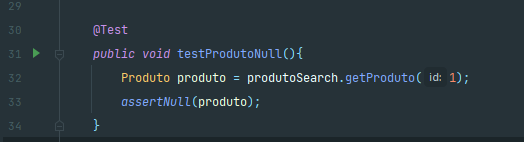
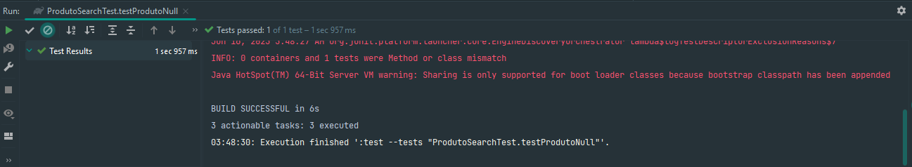
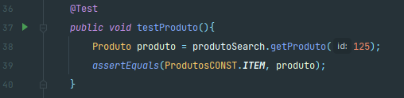
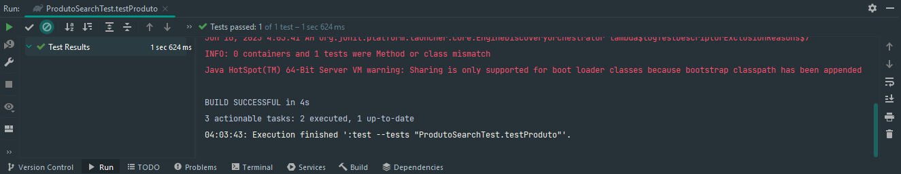
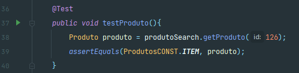
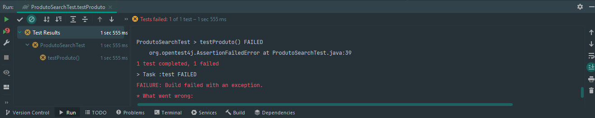

# Mockoup de Classes: Mockito

**Integrantes: Gabriella Souza Aguiar e Wallace Freitas Oliveira**

# Introdução

O processo de testes é uma etapa fundamental no desevolvimento de softwares, pois durante a execução dessa se torna possivel verificar e corrigir se necessário diversos aspectos da solução impelementada, garantindo assim a melhor qualidade possivel do projeto. Os teste de softwares se dividem em diferentes tipos: testes unitarios, de integração e de sistema, cada um desses apresentam suas especificidades própias e motivações para seu uso. Nesse pequeno tutorial abordaremos o processo de teste unitário ultilizando da estratégia de mockoup de classes, para realizar a verificação de classes em java, com o auxilio do Framework Mockito.

Iniciamos definindo a motivação para realizar testes de classes, imagine-se na seguinte situação: Você deve implementar uma nova classe X que depende da integração com uma classe Y. No entanto, para assegurar o ideal funcionamento de X, é necessário que essa classe seja testada, mas como realizar esse teste, uma vez que X depende do funcionamento de Y, e é nesse momento que surge a necessidade de realizar o mockoup de classes. O mockoup de classes, consiste na criação de objetos simulados dentro de um sistemas de testes para que outras classes dependentes da classe mockada consigam ser testadas. Esses objetos criados, imitam o comportamento real da classe base (classe da qual foi instânciada) permitindo assim, que as demais as ultilizem para realizar os testes necessários de maneira isolada e verificar o funcionamento da solução.

# Mockito Framework

O framework Mockito, é uma das soluções de código aberto mais conhecidas e amplamente ultilizadas para realização de testes unitários em java quando o foco é na implementação de mocks de classes e interfaces. Atualmente é mantido e atualizado pela comunidade de desenvolvedores através do gitHub (https://github.com/mockito/mockito) e se encontra na versão 5 adotando o suporte ao Java na versão JDK 11.

*OBS - Para execultar ultilizando JDK 8 deve-se ultilizar a versão 4 do Mockito*

# Configurando o Ambiente

Para começar a utilizar o Mockito em um projeto Java é necessario iniciar com a importação do framework atraves do gerenciador de dependências de sua preferência, abaixo exemplificamos como realizar essa importação atraves do Maven ou Gradle:

`Maven`

*Configuração pom.xml*

```xml
<dependencies>
        <dependency>
            <groupId>org.junit.jupiter</groupId>
            <artifactId>junit-jupiter-engine</artifactId>
            <version>5.9.2</version>
            <scope>test</scope>
        </dependency>

        <dependency>
            <groupId>org.mockito</groupId>
            <artifactId>mockito-core</artifactId>
            <version>5.3.1</version>
        </dependency>
</dependencies>
```

`Gradle`

*Configuração build.gradle*
```java
repositories {
    mavenCentral()
}

dependencies {
    testImplementation 'org.junit.jupiter:junit-jupiter-api:5.9.2'
    testRuntimeOnly 'org.junit.jupiter:junit-jupiter-engine:5.9.2'
    testImplementation 'org.mockito:mockito-core:5.2.0'
}

test {
    useJUnitPlatform()
}
```

*OBS: O framework JUnit5 está sendo importado em conjunto ao Mockito e foi ultilizado para gerar a plataforma de testes.*

*Consulte a documentação para maiores detalhes: https://junit.org/junit5/docs/current/user-guide/*

# Iniciando os Testes

Para esse tutorial ultilizamos como exemplo a elaboração de um pequeno sistema de pesquisa de produtos, composto por 2 classes de solução e uma de teste. Em uma situação real poderia ser necessária a implementação de diversas outras classes bases e de testes que represetassem o objeto real tratado pelo projeto desevolvido. 

## Classes Bases e Interface

O primeiro passo desse tutorial é implementar dentro de **src/main/java** as seguintes classes:

`Produto`

A classe produto define um produto dentro de nosso exemplo, e é composta basicamente pelos atribultos id, nome e valor e pelos metodos getter's e setter's, além de um construtor único.

```Java
public class Produto {
    private  int id;
    private String nome;
    private double valor;

    public Produto(int id, String nome, double valor){
        setId(id);
        setNome(nome);
        setValor(valor);
    }

    public int getId() { return id; }

    public void setId(int id) { this.id = id; }

    public String getNome() { return nome; }

    public void setNome(String nome) { this.nome = nome;}

    public double getValor() { return valor; }

    public void setValor(double valor) { this.valor = valor;}
}
```

`ProdutoSearch`

A classe ProdutoSearch simula uma possivel classe que comunicaria com serviços em um sistema real, um tipo de DAO, e possui um unico atribulto produto que é uma instância da interface ProdutoService.

```Java
public class ProdutoSearch {
    private final ProdutoService produto;

    public ProdutoSearch(ProdutoService produto){
        this.produto = produto;
    }

    public Produto getProduto(int id){
        return produto.getProduto(id);
    }
}
```

`ProdutoService`

```Java
public interface ProdutoService {
    Produto getProduto(int id);
}
```

## Implementado o Teste

Após realizar o primeiro passo e ter criado as classes da solução a ser testada podemos partir para implementação dos testes da classe ProdutoSearch. Para isso devemos criar as classes ProdutoSearchTeste e ProdutosCONST, sendo a primeira a classe principal de testes e a segundo os mocks a serem instânciados.

`ProdutoSearchTeste`

A classe ProdutoSearchTeste é a classe base de teste, é nela em que serão escritas o comportamento de testes e por onde a solução deve ser testada afim de verificar o devido funcionamento da solução. Ela apresenta dois diferentes atribultos, o primeiro ***produtoServiceTeste*** representa uma instância da interface ***ProdutoService*** que servira como parâmetro para classe testada, a ProdutoSearch, que também se encontra instânciada no ambiente de teste como ***produtoSearch***.

O Construtor da classe de testes, **public void init()**, inicializa o objeto ***produtoServiceTeste*** através de mockagem estática da resposta da **ProdutoService**, em sua primeira linha, enquanto que nas duas seguintes, define qual objeto deve ser retornado ao mock de acordo com a entrada recebida. E finaliza realizado a inicialização do objeto ***produtoSearch*** passando como paramêtro o objeto mockado.

O metodo ***testProdutoNull()*** realizará o teste simulando uma entrada não encontrada ou inválida que deverá retornar um produto nulo. 
Enquanto o metodo ***testProduto()*** realizará o teste simulando uma entrada bem sucedida, e retornar um produto válido.

Para execultar qualquer um dos metodos de testes, está faltando apenas definir os objetos ***NULL*** e ***ITEM*** pertecentes a **ProdutosCONST**.

```Java
import org.junit.jupiter.api.BeforeEach;
import org.junit.jupiter.api.Test;
import org.mockito.Mockito;

import static org.junit.jupiter.api.Assertions.assertEquals;
import static org.junit.jupiter.api.Assertions.assertNull;

public class ProdutoSearchTest {

    private ProdutoService produtoServiceTeste;
    private ProdutoSearch produtoSearch;

    @BeforeEach
    public void init() {
        produtoServiceTeste = Mockito.mock(ProdutoService.class);

        Mockito.when(produtoServiceTeste.getProduto(Mockito.anyInt())).thenReturn(ProdutosCONST.NULL);
        Mockito.when(produtoServiceTeste.getProduto(125)).thenReturn(ProdutosCONST.ITEM);

        produtoSearch = new ProdutoSearch(produtoServiceTeste);
    }

    @Test
    public void testProdutoNull(){
        Produto produto = produtoSearch.getProduto(1);
        assertNull(produto);
    }

    @Test
    public void testProduto(){
        Produto produto = produtoSearch.getProduto(125);
        assertEquals(ProdutosCONST.ITEM, produto);
    }

}
```

`ProdutosCONST`

A classe **ProdutosCONST** realiza apenas o instanciamento de dois atribultos que servirão como mock's para o teste. Sendo o primeiro um objeto do tipo **Produto** setado como ***null***, e o segundo pertencente ao mesmo tipo, no entando instâncido como um item válido.

```Java
public class ProdutosCONST {
    public static final Produto NULL = null;
    public static final Produto ITEM = new Produto(125, "Item A", 6.7);
}
```

Uma vez implementada todas as classes acima, basta execultar algum dos metodos (clicando no icone de iniciar ao lado do metódo) de testes e aguardar a realização do mesmo para que verifique o funcionamento ideal do programa. Se o teste for bem sucedido, o resultado exibido no terminal iniciado será do tipo **TESTS PASSED**, caso contrário, será exibida a exceção lançada pelo programa e o resultado **TESTS FAILED**. Conforme ilustrado abaixo:

*Testando testProdutoNull():*



*Resultado testProdutoNull():*



*Testando testProduto() - Caso Sucesso:*



*Resultado testProduto() - Resultado Sucesso:*



*Testando testProduto() - Caso Erro:*



*Resultado testProduto() - Resultado Erro:*



# Ferramentas similares

`EasyMock`

O EasyMock é um framework de mocking para testes unitários em Java;
é amplamente utilizado no meio dos desenvolvedores por proporcionar testes unitários eficientes e confiáveis.

Ele cria objetos falsos que substituem dependências externas no ambiente de teste, como por exemplo, serviços externos ou bancos de dados.
Assim, a ferramenta também facilita a criação e configuração dos Mocks, pois permite definir comportamentos e especificar métodos que serão chamados, argumentos utilizados e exceções, por exemplo.

A síntaxe do EasyMock é simples: podem ser usados os métodos expect() e replay() para especificar o comportamento dos mocks e utilizar o verify() para verificação das chamadas e, consequentemente, certificar se foram feitas corretamente.


`PowerMock`

O PowerMock é uma extensão do Mockito e do EasyMock, essa ferramenta oferece recursos adicionais e permite a criação de mocks para, por exemplo:

* Classes estáticas, o que permite simular comportamentos específicos para esses métodos durante os testes; 
* Construtores privados, permitindo a simulação de objetos díficeis de serem mockados. 

Uma vantagem do PowerMock é a integração com as frameworks das quais ele se extende, sendo assim, é possível usar recursos dos três ao mesmo tempo.
No entanto, deve ser utilizado com moderação, pois seu uso tornar os testes ilegíveis por violar princípios de design, com a criação de mocks para classes estáticas e construtores privados.


`JMockit`

O JMockit é um projeto de código aberto e é conhecido por sua flexibilidade e recursos avançados de mocking. Essa framework permite a criação de mocks para:

* Classes concretas, que permite simular comportamentos específicos dessas classes nos testes, sem ser preciso alterar o código escrito originalmente;
* Interfaces, permititindo simular o comportamento de objetos que implementam as interfaces;
* Métodos estáticos e Construtores, o que possibilita a simulação dos mesmos de comportamentos específicos deles, durante os testes.

O JMockit também conta com a Expectations API e a Verifications API, que permitem definir comportamentos tais como retorno de valores, lançamentos de exceçõese e também verifica se os determinados métodos foram chamados nos mocks com os argumentos corretos, respectivamente.
Além disso, é possível destacar que a ferramenta é compatível com outras ferramentas de teste como o JUnit e TestNG, por exemplo.

Sendo assim, essa é uma ferramenta que conta com recursos avançados de mocking, no entanto, é necessário estudá-la e conhecê-la inteiramente para desfrutar de todos os recursos que dispõe.


